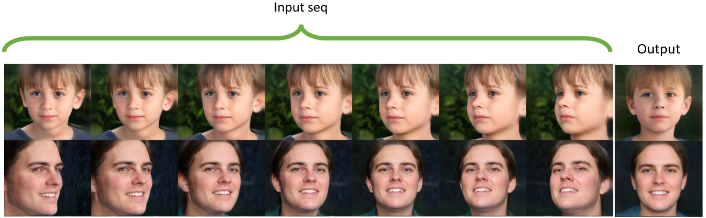

# Face-frontalization-in-image-sequences-using-GAN-Inversion
[Github Repository](https://github.com/mhahmadi258/Face-frontalization-in-image-sequences-using-GAN-Inversion.git)

<!-- <a href="http://colab.research.google.com/github/eladrich/pixel2style2pixel/blob/master/notebooks/inference_playground.ipynb"></a>   -->

> Nowadays, with the widespread use of cameras across various domains and the significant increase in the availability of facial images, their processing has gained considerable importance. The quality of an image and its complexity, particularly in terms of pose variation, can significantly influence these processes. To tackle the challenge of pose variation, many approaches have been proposed for face frontalization. However, due to their reliance on heavy architectures and complicated training procedures, these approaches often lead to low-quality image reconstruction. Another drawback is that despite the availability of multiple images as frames in a video— which inherently contain more information— these methods reconstruct the frontal-view image by processing only a single input image. We address all of the above obstacles by proposing a novel approach that is capable of reconstructing the frontal-view image with photorealistic quality. For this purpose, we first present an innovative solution to provide a diverse dataset with high quality. Furthermore, we propose a novel single-image method with considerably fewer trainable parameters for face frontalization by incorporating the GAN inversion technique with a transfer learning approach. Following this, by employing and extending this method, we introduce a new approach for processing sequences of images, capable of leveraging both the independent and collective insights from all frames. Lastly, through the comprehensive analysis of our methods and comparing them with previous approaches, we demonstrate their effective capability to reconstruct frontal-view images with photorealistic quality.


<br>
Our proposed methods can be used to reconstruct the frontal-view face by giving a single image or a sequence of images.
</p>

## Description   
Official Implementation of my master thesis for both training and evaluation. Our proposed methods extend the E2Style model to 
allow face frontalization for both single-image and multi-image.

## Table of Contents
- [Face-frontalization-in-image-sequences-using-GAN-Inversion](#face-frontalization-in-image-sequences-using-gan-inversion)
  - [Description](#description)
  - [Table of Contents](#table-of-contents)
  - [Applications](#applications)
    - [Single-Image Face Frontalization](#single-image-face-frontalization)
    - [Multi-Image Face Frontalization](#multi-image-face-frontalization)
  - [Getting Started](#getting-started)
    - [Prerequisites](#prerequisites)
    - [Installation](#installation)
    - [Pretrained Models](#pretrained-models)
    - [Dataset](#dataset)
  - [Training](#training)
    - [Preparing your Data](#preparing-your-data)
    - [Training models](#training-models)
      - [Training the Single-Image Encoder](#training-the-single-image-encoder)
      - [Training the Multi-Image Encoder](#training-the-multi-image-encoder)
    - [Additional Notes](#additional-notes)
  - [Testing](#testing)
    - [Inference](#inference)
  - [Acknowledgements](#acknowledgements)
  <!-- * [Citation](#citation) -->
  

## Applications
### Single-Image Face Frontalization  
Here, we use single image to reconstruct the frontal-view face. 
<p align="center">

</p>


### Multi-Image Face Frontalization 
Here, we use multiple images, considered as frames of a short video, to reconstruct the frontal-view face.
<p align="center">

</p>


## Getting Started
### Prerequisites
- Linux or macOS
- NVIDIA GPU + CUDA CuDNN (CPU may be possible with some modifications, but is not inherently supported)
- Python 2 or 3
```bash
$ conda install --yes -c pytorch pytorch=1.7.1 torchvision cudatoolkit=11.0
$ pip install matplotlib scipy opencv-python pillow scikit-image tqdm tensorflow-io
```

### Installation
- Clone this repo:
``` 
git clone https://github.com/mhahmadi258/Face-frontalization-in-image-sequences-using-GAN-Inversion.git
cd Face-frontalization-in-image-sequences-using-GAN-Inversion
```
<!-- ### Inference Notebook
To help visualize our proposed method on single-image and multi-image and to help you get started, we provide a Jupyter notebook found in `notebooks/inference_playground.ipynb`.   
The notebook will download the necessary pretrained models and run inference on the images found in `notebooks/images`.   -->

### Pretrained Models
Please download the pre-trained models from the following links. Each model contains the entire architecture, including the encoder, decoder and adapter blockes weights.
| Path | Description
| :--- | :----------
|[Single-Image Face Frontalization ](https://drive.google.com/file/d/1UPCJAQCNiSbk3mhpM3kEREwCuEuA5te-/view?usp=drive_link)  | The proposed model for processing single input. 
|[Multi-Image Face Frontalization](https://drive.google.com/file/d/1O5MNjjC39BfR4zukRicCWHqzJEeZCwgC/view?usp=drive_link)  | The proposed model for processing multi input.

If you wish to use one of the pretrained models for training or inference, you may do so using the flag `--checkpoint_path`.

In addition, we provide various auxiliary models needed for training your own Face Frontalization model from scratch.
| Path | Description
| :--- | :----------
|[E2Style StyleGAN Inversion](https://drive.google.com/file/d/1CzMDA88GJgVzc5JxKt3-l504a7TuSw5j/view?usp=sharing) | E2style model pretrained on FFHQ taken from [wty-ustc](https://github.com/wty-ustc/e2style) for StyleGAN inversion.
|[IR-SE50 Model](https://drive.google.com/file/d/1KW7bjndL3QG3sxBbZxreGHigcCCpsDgn/view?usp=sharing) | Pretrained IR-SE50 model taken from [TreB1eN](https://github.com/TreB1eN/InsightFace_Pytorch) for use in our ID loss during pSp training.
|[MTCNN](https://drive.google.com/file/d/1tJ7ih-wbCO6zc3JhI_1ZGjmwXKKaPlja/view?usp=sharing)  | Weights for MTCNN model taken from [TreB1eN](https://github.com/TreB1eN/InsightFace_Pytorch) for use in ID similarity metric computation. (Unpack the tar.gz to extract the 3 model weights.)

By default, we assume that all auxiliary models are downloaded and saved to the directory `pretrained_models`. However, you may use your own paths by changing the necessary values in `configs/path_configs.py`. 

### Dataset
Our synthesised dataset can be acessed throug following links. Each sample is a short video file in the fromat of .mp4. Each video comprises 8 frames, with the initial frame presenting the frontal view, while the subsequent frames form a short video illustrating a rotation of the face.
| Path | Description
| :--- | :----------
|[Training Dataset](https://drive.google.com/file/d/13hzKmoz_blCqtBVMrx0AnN44qBFkiGyY/view?usp=drive_link) | 8000 video files, each consisting of 8 frames with a resolution of 512x512.
|[Testing Dataset](https://drive.google.com/file/d/1tnCb2-C3aMKrzHbACrWHOA8-vkFvyDBl/view?usp=drive_link) | 1200 video files, each consisting of 8 frames with a resolution of 512x512.

Note that we did not use all the above samples for training or testing. 

## Training
### Preparing your Data

- Refer to `configs/paths_config.py` to define the necessary data paths and model paths for training and evaluation. 
- Refer to `configs/transforms_config.py` for the transforms defined for each dataset/experiment. 
- Finally, refer to `configs/data_configs.py` for the source/target data paths for the train and test sets
    as well as the transforms.
    

### Training models
The main training script can be found in `scripts/train.py`.   
Intermediate training results are saved to `opts.exp_dir`. This includes checkpoints, train outputs, and test outputs.  
Additionally, if you have tensorboard installed, you can visualize tensorboard logs in `opts.exp_dir/logs`.

#### Training the Single-Image Encoder
```
python scripts/train.py \
--dataset_type=frontalization \
--exp_dir=/path/to/experiment \
--workers=8 \
--batch_size=16 \
--test_batch_size=16 \
--test_workers=8 \
--val_interval=5000 \
--save_interval=5000 \
--start_from_latent_avg \
--lpips_lambda=1.0 \
--lpips_lambda=0.8 \
--l2_lambda=1 \
--id_lambda=0.5 \
--parse_lambda=1 \
--checkpoint_path="/path/to/checkpoint/inversion.pt"
```

#### Training the Multi-Image Encoder
```
python scripts/train.py \
--dataset_type=frontalization \
--exp_dir=/path/to/experiment \
--workers=8 \
--batch_size=16 \
--test_batch_size=16 \
--test_workers=8 \
--val_interval=5000 \
--save_interval=5000 \
--start_from_latent_avg \
--lpips_lambda=1.0 \
--lpips_lambda=0.8 \
--l2_lambda=1 \
--id_lambda=0.5 \
--parse_lambda=1 \
--checkpoint_path="/path/to/checkpoint/inversion.pt"
```

### Additional Notes
- See `options/train_options.py` for all training-specific flags. 
- See `options/test_options.py` for all test-specific flags.
- By default, we assume that the StyleGAN used outputs images at resolution `1024x1024`. If you wish to use a StyleGAN at a smaller resolution, you can do so by using the flag `--output_size` (e.g., `--output_size=256`). 


## Testing
### Inference
Having trained your model, you can use `scripts/inference.py` to apply the model on a set of images.   
For example, 
```
python scripts/inference.py \
--exp_dir=/path/to/experiment \
--checkpoint_path=experiment/checkpoints/best_model.pt \
--data_path=/path/to/test_data \
--test_batch_size=1 \
--test_workers=4 \
--save_inverted_codes \
--couple_outputs \
--resize_outputs
```
Additional notes to consider: 
- During inference, the options used during training are loaded from the saved checkpoint and are then updated using the 
test options passed to the inference script.
- Adding the flag `--couple_outputs` will save an additional image containing the input and output images side-by-side in the sub-directory
`inference_coupled`. Otherwise, only the output image is saved to the sub-directory `inference_results`.
- Adding the flag `--save_inverted_codes` will save the inverted latent codes in the exp_dir.
- By default, the images will be saved at resolutiosn of 1024x1024, the original output size of StyleGAN. If you wish to save 
outputs resized to resolutions of 256x256, you can do so by adding the flag `--resize_outputs`.


## Acknowledgements
This code is heavily based on [pSp](https://github.com/eladrich/pixel2style2pixel) and [E2Style](https://github.com/wty-ustc/e2style) and [eg3d](https://github.com/NVlabs/eg3d).

<!-- ## Citation

If you find our work useful for your research, please consider citing the following papers :)

```
@article{wei2022e2style,
  title={E2Style: Improve the Efficiency and Effectiveness of StyleGAN Inversion},
  author={Wei, Tianyi and Chen, Dongdong and Zhou, Wenbo and Liao, Jing and Zhang, Weiming and Yuan, Lu and Hua, Gang and Yu, Nenghai},
  journal={IEEE Transactions on Image Processing},
  year={2022}
}
``` -->
